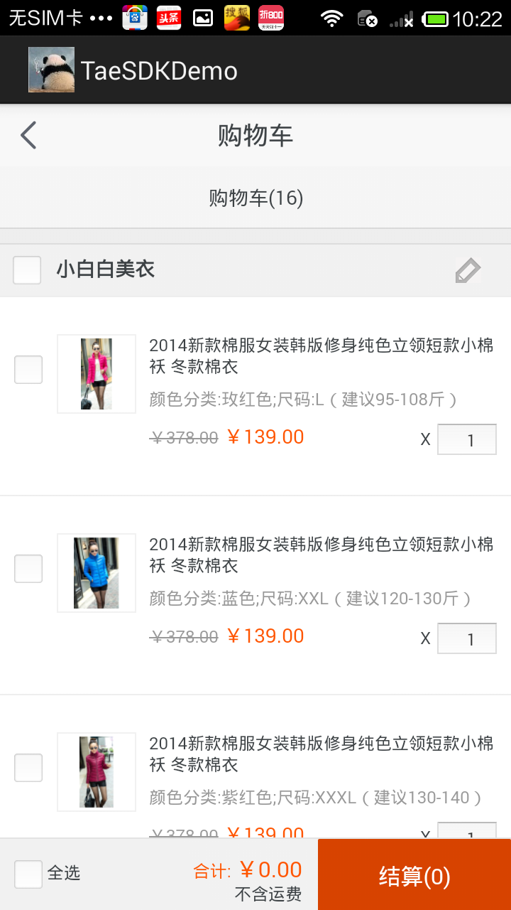
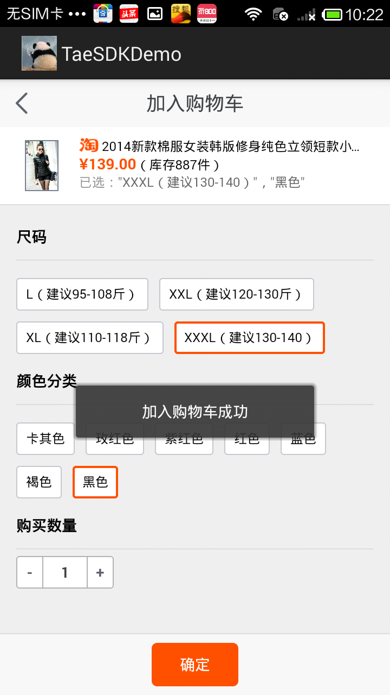
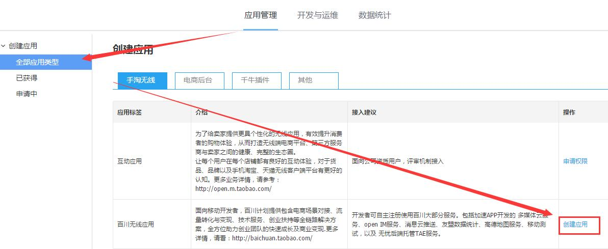
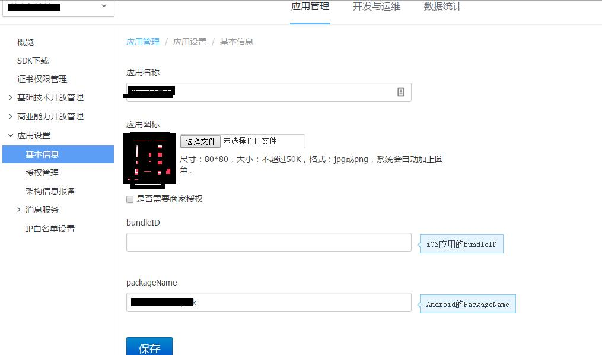
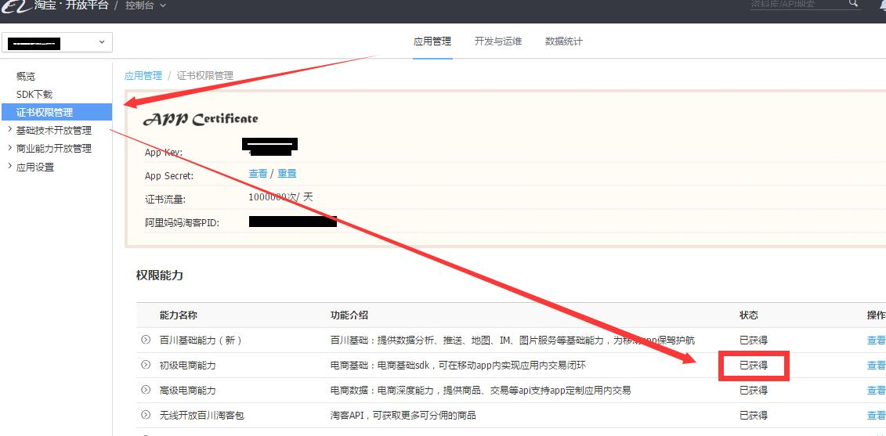
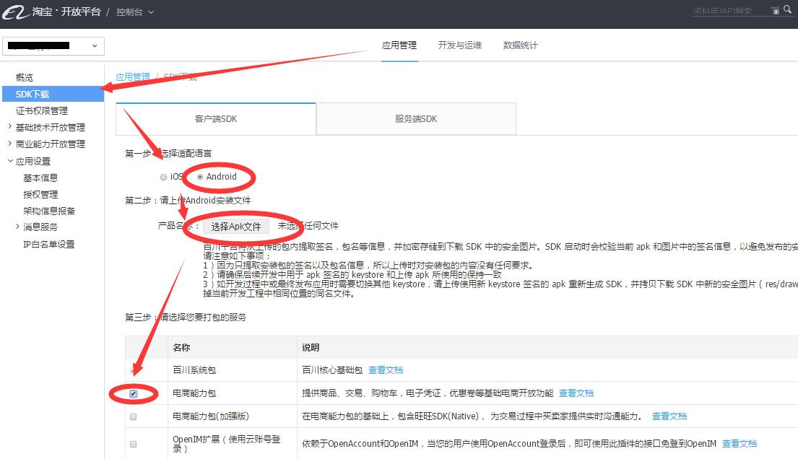
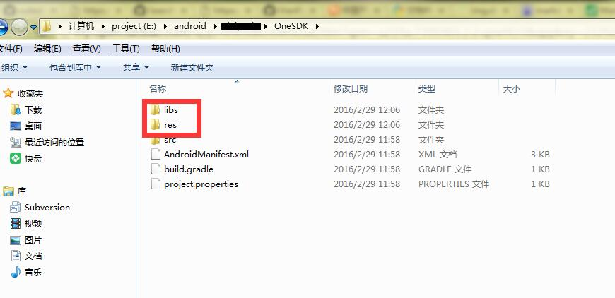

# cordova-plugin-taobao-baichuan


Cordova plugin for Taobao Baichuan SDK (淘宝百川Cordova插件)

Android is finished

iOS not ready yet

Hope some iOS developers  Join in to develop ios side(IOS版本期待您的加入)

# Feature
  1. Open taobao page in your cordova app (打开淘宝商品页面)
  2. Open taobaoke taobao page in your cordova app (打开淘宝客商品页面)
  3. No taobao login needed in order page (淘宝订单页面免登陆)
  4. Api for both h5 taobao page and naive taobao page (提供淘宝H5以及原生两种方式打开商品界面)


# Example

See [cordova-plugin-taobao-baichuan/example_www](https://github.com/xu-li/cordova-plugin-taobao-baichuan/example_www)


# Usage

## Show taobao item page 打开淘宝商品


TaobaoBaichuan.item_show(args, successCallback, errorCallback)

 * args.itemid: taobao item id; 商品id.支持标准的商品id，eg.37196464781；同时支持openItemId，必填，不允许为null；
 * args.type: default 'taobao' for naive,'h5' for html5 style; 淘宝打开方式，默认原生,也可以是h5方式
 * args.pid: default null, taobaoke pid; 淘宝联盟PID
 * successCallback: function 成功后回调
 * errorCallback function 失败后回调
 
 
 ```Javascript
 TaobaoBaichuan.item_show({
        itemid:'39155470728',
        type:'taobao'
     },function(){
         console.log(" success");
     },function(err){
         console.log("err:"+err);
 });
 ```

 


## Show taobao cart page 打开淘宝购物车
TaobaoBaichuan.cart_show(successCallback, errorCallback)
 * successCallback: function 成功后回调
 * errorCallback function 失败后回调
 
```Javascript
TaobaoBaichuan.cart_show(function(){
        console.log(" success");
    },function(err){
        console.log("err:"+err);
});
```

 
 
## Add item to taobao cart 将商品加入到淘宝购物车
TaobaoBaichuan.cart_add(openid,successCallback, errorCallback)
 * openid 商品openid 
 * successCallback: function 成功后回调
 * errorCallback function 失败后回调
 
```Javascript
TaobaoBaichuan.cart_add("AHd5d-HAAeGwJedwSnHktBI",function(){
        console.log(" success");
    },function(err){
        console.log("err:"+err);
});
```
 

## Show orders page 打开淘宝订单页面


TaobaoBaichuan.orders_show(successCallback, errorCallback)
 * successCallback: function 成功后回调
 * errorCallback function 失败后回调
 
```Javascript
TaobaoBaichuan.orders_show(function(){
        console.log(" success");
    },function(err){
        console.log("err:"+err);
});
```

 
# Prepare 安装预备(必读)

   1. [注册您的百川账号](http://baichuan.taobao.com/portal/index.htm)
   
   
   2. 创建 百川无线应用
   
      
      
      
   3. 完善你的应用 基本信息
   
      
      
      
   4. 申请开通  初级电商能力
   
      
      
      
   5. 生成客户端SDK包，并下载
      
      

   6. 解压到下载的SDK
   
      
      
   7. 将上一步中的 libs以及res目录 覆盖到 你的cordova项目目录下的\platforms\android 中
   
     
     
# Install

1. 
2. ```cordova build ios``` or ```cordova build android```

3. (iOS only) if your cordova version <5.1.1,check the URL Type using XCode


# FAQ
  
# TODO

百川SDK在app内实现应用内淘宝交易闭环，用户可以不跳转手机淘宝，在APP内直接购买淘宝商品，极大的优化了无线购买体验；还提供阿里妈妈淘客分佣能力，在SDK中有带淘客结算的交易流程，让开发者获得导购佣金。

[更多百川信息](http://baichuan.taobao.com/doc2/detail?spm=a3c0d.7662649.0.0.XTcmuf&treeId=30&articleId=103655&docType=1)